# Class Diagrams

Generated from the sources by `scripts/uml.sh`. Edit `scripts/uml.yml`, not this file.

## overview

```mermaid
---
title: CDR Processor — overview
---
%%{init: {"theme": "dark", "themeVariables": {"lineColor": "#a0a8b4"}}}%%
classDiagram
    class C_0005204266784183112504["IIngestor"]
    class C_0005204266784183112504 {
        <<abstract>>
        +start() bool*
        +stop() void*
    }
    class C_0004842097886665373725["CdrRecord"]
    class C_0004842097886665373725 {
        +bytesReceived : uint64_t
        +bytesTransmitted : uint64_t
        +callTime : std::time_t
        +duration : uint64_t
        +secondPartyIMSI : uint64_t
        +secondPartyMSISDN : uint64_t
        +sequence : uint64_t
        +subscriberImei : std::string
        +subscriberImsi : uint64_t
        +subscriberMSISDN : uint64_t
        +usageType : UsageType
    }
    class C_0011437531385295172426["ISink"]
    class C_0011437531385295172426 {
        <<abstract>>
        +consume(std::vector&lt;CdrRecord&gt; & batch, std::string_view source) void*
        +resume_at(std::string_view source) uint64_t
    }
    class C_0015450104558118286089["IParser"]
    class C_0015450104558118286089 {
        <<abstract>>
        +parse(std::string_view line) [const] std::optional&lt;CdrRecord&gt;*
    }
    class C_0015551976288975165073["FileIngestor"]
    class C_0015551976288975165073 {
        +FileIngestor(ISink & sink) void
        +FileIngestor(ISink & sink, const FileDirs & dirs) void
        -dispose(const std::string & file_path, bool ok) void
        -feed() void
        -process(const std::string & file_path) void
        +start() bool
        +stop() void
        -m_dirs : FileDirs
        -m_feeder : std::thread
        -m_format : std::string
        -m_parser : std::unique_ptr&lt;IParser&gt;
        -m_running : bool
        -m_sink : ISink &
        -m_stop : std::atomic&lt;bool&gt;
        -m_thread_pool : std::unique_ptr&lt;ThreadPool&gt;
        -m_watcher : DirWatcher
    }
    class C_0016309531056379409339["RabbitIngestor"]
    class C_0016309531056379409339 {
        +RabbitIngestor(ISink & sink) void
        -backoff(unsigned int delay_ms) void
        -consume(std::size_t id) void
        +start() bool
        +stop() void
        -m_conns : std::vector&lt;std::unique_ptr&lt;RabbitConn&gt;&gt;
        -m_format : std::string
        -m_running : bool
        -m_sink : ISink &
        -m_stop : std::atomic&lt;bool&gt;
        -m_threads : std::vector&lt;std::thread&gt;
    }
    class C_0010532161306050576947["ICdrSource"]
    class C_0010532161306050576947 {
        <<abstract>>
        +next(std::vector&lt;CdrRecord&gt; & out) Status*
    }
    class C_0015504900303477001044["RabbitSource"]
    class C_0015504900303477001044 {
        +RabbitSource(RabbitConn & connection) void
        +last_tag() [const] uint64_t
        +next(std::vector&lt;CdrRecord&gt; & out) Status
        +parsed() [const] uint64_t
        +rejected() [const] uint64_t
        +stop() void
        -m_conn : RabbitConn &
        -m_last_tag : uint64_t
        -m_parsed : uint64_t
        -m_parser : std::unique_ptr&lt;IParser&gt;
        -m_rejected : uint64_t
        -m_stop : std::atomic&lt;bool&gt;
    }
    class C_0016628722800302877088["FileSource"]
    class C_0016628722800302877088 {
        +FileSource(const std::string & file_path, const IParser & parser, uint64_t resume_seq = 0) void
        -log_summary() void
        +next(std::vector&lt;CdrRecord&gt; & out) Status
        -parse_header(const char * data, std::size_t length, Fileheader & header) const char *
        -m_end : const char *
        -m_failed : bool
        -m_header : Fileheader
        -m_map : MappedFile
        -m_name : std::string
        -m_parsed : std::size_t
        -m_parser : const IParser &
        -m_pos : const char *
        -m_rejected : std::size_t
        -m_resume_seq : uint64_t
        -m_started : std::chrono::steady_clock::time_point
        -m_summed : bool
    }
    class C_0015765625140678909184["CsvParser"]
    class C_0015765625140678909184 {
        +CsvParser(char separator = '|') void
        +parse(std::string_view line) [const] std::optional&lt;CdrRecord&gt;
        -m_sep : char
    }
    class C_0008391949454572926139["Delta"]
    class C_0008391949454572926139 {
        +links : LinkMap
        +ops : OpMap
        +subs : SubMap
    }
    class C_0012987976901397680227["IStore"]
    class C_0012987976901397680227 {
        <<abstract>>
        +flush() bool*
        +increment(std::string_view key, std::string_view field, uint64_t value) bool*
        +mark(std::string_view source, uint64_t seq) bool*
        +rank(std::string_view board, std::string_view member, uint64_t value) bool*
        +resume_at(std::string_view source) uint64_t*
    }
    class C_0001003986061494381294["AggregateWriter"]
    class C_0001003986061494381294 {
        +AggregateWriter(IStore & store) void
        -add(std::string_view key, std::string_view field, uint64_t value) bool
        +write(const Delta & delta) bool
        +write(const Totals & totals) bool
        -m_store : IStore &
    }
    class C_0000075638799718834364["Aggregator"]
    class C_0000075638799718834364 {
        -addLink(LinkMap & links, uint64_t a, uint64_t b, uint64_t dur, uint64_t sms, uint64_t cnt) void$
        +fold(const std::vector&lt;CdrRecord&gt; & batch, Delta & out) [const] void
    }
    class C_0013992063804294937841["RankWriter"]
    class C_0013992063804294937841 {
        +RankWriter(IStore & store) void
        -add(std::string_view board, std::string_view member, uint64_t value) bool
        -appendNumber(std::string & out, uint64_t value) void$
        +write(const Delta & delta) bool
        -m_store : IStore &
    }
    class C_0009211040578075549081["RedisStore"]
    class C_0009211040578075549081 {
        -batch() redisContext *
        -drain() bool
        +flush() bool
        +increment(std::string_view key, std::string_view field, uint64_t value) bool
        +mark(std::string_view source, uint64_t seq) bool
        +rank(std::string_view board, std::string_view member, uint64_t value) bool
        +resume_at(std::string_view source) uint64_t
    }
    class C_0014416660323480142591["AggregateSink"]
    class C_0014416660323480142591 {
        +AggregateSink(std::unique_ptr&lt;IStore&gt; store) void
        +consume(std::vector&lt;CdrRecord&gt; & batch, std::string_view source) void
        +resume_at(std::string_view source) uint64_t
        +snapshot() [const] Totals
        -m_aggregator : Aggregator
        -m_ranks : RankWriter
        -m_store : std::unique_ptr&lt;IStore&gt;
        -m_totals : RunTotals
        -m_writer : AggregateWriter
    }
    class C_0016825886504236010012["IQueryStore"]
    class C_0016825886504236010012 {
        <<abstract>>
        +dbsize(uint64_t & out) [const] bool*
        +hgetall(const std::string_view key, Fields & out) [const] bool*
        +hkeys(const std::string_view key, std::vector&lt;std::string&gt; & out) [const] bool*
        +hmget(const std::string_view key, const std::vector&lt;std::string&gt; & field_names, std::vector&lt;std::string&gt; & out) [const] bool*
        +top(std::string_view board, std::size_t offset, std::size_t limit, Ranked & out, uint64_t & count) [const] bool*
    }
    class C_0007436692389984772457["RedisQuery"]
    class C_0007436692389984772457 {
        -command(int argc, const char ** argv, const std::size_t * lens) redisReply *$
        +dbsize(uint64_t & out) [const] bool
        -element_score(const redisReply * element) uint64_t$
        -element_str(const redisReply * element) std::string$
        +hgetall(const std::string_view key, Fields & out) [const] bool
        +hkeys(const std::string_view key, std::vector&lt;std::string&gt; & out) [const] bool
        +hmget(const std::string_view key, const std::vector&lt;std::string&gt; & field_names, std::vector&lt;std::string&gt; & out) [const] bool
        +top(std::string_view board, std::size_t offset, std::size_t limit, Ranked & out, uint64_t & count) [const] bool
    }
    class C_0013169109224289640608["PathService"]
    class C_0013169109224289640608 {
        +PathService(const IQueryStore & store) void
        -found(const std::vector&lt;std::string&gt; & route, bool weights) [const] Result
        -hops(const std::vector&lt;std::string&gt; & route, std::vector&lt;Json&gt; & out) [const] bool
        -notFound() std::string$
        +path(std::string_view first, std::string_view second, bool weights) [const] Result
        -walk(const Trail & head, const Trail & tail, const std::string & meet) std::vector&lt;std::string&gt;$
        -m_store : const IQueryStore &
    }
    class C_0006341152374390112720["QueryService"]
    class C_0006341152374390112720 {
        +QueryService(const IQueryStore & store) void
        +link(std::string_view first, std::string_view second) [const] Result
        +msisdn(std::string_view msisdn) [const] Result
        +op(std::string_view mccmnc) [const] Result
        +peers(std::string_view msisdn, const QueryParams & params) [const] Result
        -weighted(std::string_view msisdn, const QueryParams & params) [const] Result
        -m_store : const IQueryStore &
    }
    class C_0004290539103002244799["RankService"]
    class C_0004290539103002244799 {
        +RankService(const IQueryStore & store) void
        -keyOf(std::string_view board) std::string_view$
        +top(std::string_view board, const QueryParams & params) [const] Result
        -m_store : const IQueryStore &
    }
    class C_0005488252523494370716["StatsService"]
    class C_0005488252523494370716 {
        +StatsService(const IQueryStore & store) void
        +health() [const] Result
        +totals() [const] Result
        -m_store : const IQueryStore &
    }
    class C_0013124099472554209867["HttpGateway"]
    class C_0013124099472554209867 {
        +HttpGateway(const IQueryStore & store, int port, std::string host) void
        +port() [const] int
        -registerQueryRoutes() void
        -registerRankRoutes() void
        -registerStatsRoutes() void
        +start() bool
        +stop() void
        -m_host : const std::string
        -m_listener : std::thread
        -m_paths : const PathService
        -m_port : int
        -m_ranks : const RankService
        -m_running : bool
        -m_server : std::unique_ptr&lt;httplib::Server&gt;
        -m_service : const QueryService
        -m_stats : const StatsService
    }
    C_0011437531385295172426 ..> C_0004842097886665373725 : 
    C_0015450104558118286089 ..> C_0004842097886665373725 : 
    C_0015551976288975165073 --> C_0011437531385295172426 : -m_sink
    C_0015551976288975165073 o-- C_0015450104558118286089 : -m_parser
    C_0005204266784183112504 <|-- C_0015551976288975165073 : 
    C_0016309531056379409339 --> C_0011437531385295172426 : -m_sink
    C_0005204266784183112504 <|-- C_0016309531056379409339 : 
    C_0010532161306050576947 ..> C_0004842097886665373725 : 
    C_0015504900303477001044 ..> C_0004842097886665373725 : 
    C_0015504900303477001044 o-- C_0015450104558118286089 : -m_parser
    C_0010532161306050576947 <|-- C_0015504900303477001044 : 
    C_0016628722800302877088 ..> C_0004842097886665373725 : 
    C_0016628722800302877088 --> C_0015450104558118286089 : -m_parser
    C_0010532161306050576947 <|-- C_0016628722800302877088 : 
    C_0015765625140678909184 ..> C_0004842097886665373725 : 
    C_0015450104558118286089 <|-- C_0015765625140678909184 : 
    C_0001003986061494381294 ..> C_0008391949454572926139 : 
    C_0001003986061494381294 --> C_0012987976901397680227 : -m_store
    C_0000075638799718834364 ..> C_0004842097886665373725 : 
    C_0000075638799718834364 ..> C_0008391949454572926139 : 
    C_0013992063804294937841 ..> C_0008391949454572926139 : 
    C_0013992063804294937841 --> C_0012987976901397680227 : -m_store
    C_0012987976901397680227 <|-- C_0009211040578075549081 : 
    C_0014416660323480142591 ..> C_0004842097886665373725 : 
    C_0014416660323480142591 o-- C_0000075638799718834364 : -m_aggregator
    C_0014416660323480142591 o-- C_0012987976901397680227 : -m_store
    C_0014416660323480142591 o-- C_0001003986061494381294 : -m_writer
    C_0014416660323480142591 o-- C_0013992063804294937841 : -m_ranks
    C_0011437531385295172426 <|-- C_0014416660323480142591 : 
    C_0016825886504236010012 <|-- C_0007436692389984772457 : 
    C_0013169109224289640608 --> C_0016825886504236010012 : -m_store
    C_0006341152374390112720 --> C_0016825886504236010012 : -m_store
    C_0004290539103002244799 --> C_0016825886504236010012 : -m_store
    C_0005488252523494370716 --> C_0016825886504236010012 : -m_store
    C_0013124099472554209867 ..> C_0016825886504236010012 : 
    C_0013124099472554209867 o-- C_0006341152374390112720 : -m_service
    C_0013124099472554209867 o-- C_0013169109224289640608 : -m_paths
    C_0013124099472554209867 o-- C_0005488252523494370716 : -m_stats
    C_0013124099472554209867 o-- C_0004290539103002244799 : -m_ranks

```



## aggregate

```mermaid
---
title: Aggregate
---
%%{init: {"theme": "dark", "themeVariables": {"lineColor": "#a0a8b4"}}}%%
classDiagram
    class C_0009640744578029682106["Totals"]
    class C_0009640744578029682106 {
        +add(const CdrRecord & record) void
        +add(const std::vector&lt;CdrRecord&gt; & batch) void
        +format() [const] std::string
        +busy_cnt : uint64_t
        +data_cnt : uint64_t
        +data_dur : uint64_t
        +data_rx : uint64_t
        +data_tx : uint64_t
        +failed_cnt : uint64_t
        +moc_cnt : uint64_t
        +moc_dur : uint64_t
        +mtc_cnt : uint64_t
        +mtc_dur : uint64_t
        +noans_cnt : uint64_t
        +records : uint64_t
        +sms_mo_cnt : uint64_t
        +sms_mt_cnt : uint64_t
    }
    class C_0005203435245187721673["RunTotals"]
    class C_0005203435245187721673 {
        +merge(const Totals & totals) void
        +snapshot() [const] Totals
        -m_busyCnt : std::atomic&lt;uint64_t&gt;
        -m_dataCnt : std::atomic&lt;uint64_t&gt;
        -m_dataDur : std::atomic&lt;uint64_t&gt;
        -m_dataRx : std::atomic&lt;uint64_t&gt;
        -m_dataTx : std::atomic&lt;uint64_t&gt;
        -m_failedCnt : std::atomic&lt;uint64_t&gt;
        -m_mocCnt : std::atomic&lt;uint64_t&gt;
        -m_mocDur : std::atomic&lt;uint64_t&gt;
        -m_mtcCnt : std::atomic&lt;uint64_t&gt;
        -m_mtcDur : std::atomic&lt;uint64_t&gt;
        -m_noansCnt : std::atomic&lt;uint64_t&gt;
        -m_records : std::atomic&lt;uint64_t&gt;
        -m_smsMoCnt : std::atomic&lt;uint64_t&gt;
        -m_smsMtCnt : std::atomic&lt;uint64_t&gt;
    }
    class C_0010887478950944287678["SubDelta"]
    class C_0010887478950944287678 {
        +busy : uint64_t
        +data_rx : uint64_t
        +data_tx : uint64_t
        +failed : uint64_t
        +noans : uint64_t
        +sms_in : uint64_t
        +sms_out : uint64_t
        +voice_in : uint64_t
        +voice_out : uint64_t
    }
    class C_0017794246012153393637["OpDelta"]
    class C_0017794246012153393637 {
        +sms_in : uint64_t
        +sms_out : uint64_t
        +voice_in : uint64_t
        +voice_out : uint64_t
    }
    class C_0013961113058360695160["LinkDelta"]
    class C_0013961113058360695160 {
        +cnt : uint64_t
        +dur : uint64_t
        +sms : uint64_t
    }
    class C_0006168100238794423074["LinkKey"]
    class C_0006168100238794423074 {
        +owner : uint64_t
        +peer : uint64_t
    }
    class C_0006421422352653742808["LinkHash"]
    class C_0006421422352653742808 {
        -mix(uint64_t x) uint64_t$
    }
    class C_0008391949454572926139["Delta"]
    class C_0008391949454572926139 {
        +links : LinkMap
        +ops : OpMap
        +subs : SubMap
    }
    class C_0001003986061494381294["AggregateWriter"]
    class C_0001003986061494381294 {
        +AggregateWriter(IStore & store) void
        -add(std::string_view key, std::string_view field, uint64_t value) bool
        +write(const Delta & delta) bool
        +write(const Totals & totals) bool
        -m_store : IStore &
    }
    class C_0000075638799718834364["Aggregator"]
    class C_0000075638799718834364 {
        -addLink(LinkMap & links, uint64_t a, uint64_t b, uint64_t dur, uint64_t sms, uint64_t cnt) void$
        +fold(const std::vector&lt;CdrRecord&gt; & batch, Delta & out) [const] void
    }
    class C_0013992063804294937841["RankWriter"]
    class C_0013992063804294937841 {
        +RankWriter(IStore & store) void
        -add(std::string_view board, std::string_view member, uint64_t value) bool
        -appendNumber(std::string & out, uint64_t value) void$
        +write(const Delta & delta) bool
        -m_store : IStore &
    }
    C_0005203435245187721673 ..> C_0009640744578029682106 : 
    C_0006421422352653742808 ..> C_0006168100238794423074 : 
    C_0008391949454572926139 o-- C_0010887478950944287678 : +subs
    C_0008391949454572926139 o-- C_0017794246012153393637 : +ops
    C_0008391949454572926139 o-- C_0006168100238794423074 : +links
    C_0008391949454572926139 o-- C_0013961113058360695160 : +links
    C_0001003986061494381294 ..> C_0008391949454572926139 : 
    C_0001003986061494381294 ..> C_0009640744578029682106 : 
    C_0000075638799718834364 ..> C_0008391949454572926139 : 
    C_0000075638799718834364 ..> C_0006168100238794423074 : 
    C_0000075638799718834364 ..> C_0013961113058360695160 : 
    C_0000075638799718834364 ..> C_0006421422352653742808 : 
    C_0013992063804294937841 ..> C_0008391949454572926139 : 

```

## ingest

```mermaid
---
title: Ingest
---
%%{init: {"theme": "dark", "themeVariables": {"lineColor": "#a0a8b4"}}}%%
classDiagram
    class C_0005204266784183112504["IIngestor"]
    class C_0005204266784183112504 {
        <<abstract>>
        +start() bool*
        +stop() void*
    }
    class C_0014691924432592965580["IngestorFactory"]
    class C_0014691924432592965580 {
        -IngestorFactory() void
        +createIngestor(const std::string & name, ISink & sink) [const] std::unique_ptr&lt;IIngestor&gt;
        +hasIngestor(const std::string & name) [const] bool
        +instance() IngestorFactory &$
        +registerIngestor(const std::string & name, Creator creator) void
        -m_ingestors : std::unordered_map&lt;std::string,Creator&gt;
    }
    class C_0009913003735889727705["DirWatcher"]
    class C_0009913003735889727705 {
        +DirWatcher(const std::string & source_dir, const std::string & target_dir) void
        -claim(const std::string & file_name) bool
        +next_file(std::string & path) bool
        +ok() [const] bool
        -read_events() bool
        -sweep(const std::string & dir, bool claimed) void
        +wake() void
        -m_event_fd : int
        -m_fd : int
        -m_queue : std::deque&lt;std::string&gt;
        -m_source_dir : std::string
        -m_target_dir : std::string
        -m_wd : int
    }
    class C_0015825849209398321221["FileDirs"]
    class C_0015825849209398321221 {
        +done : std::string
        +fail : std::string
        +process : std::string
        +ready : std::string
    }
    class C_0015551976288975165073["FileIngestor"]
    class C_0015551976288975165073 {
        +FileIngestor(ISink & sink) void
        +FileIngestor(ISink & sink, const FileDirs & dirs) void
        -dispose(const std::string & file_path, bool ok) void
        -feed() void
        -process(const std::string & file_path) void
        +start() bool
        +stop() void
        -m_dirs : FileDirs
        -m_feeder : std::thread
        -m_format : std::string
        -m_parser : std::unique_ptr&lt;IParser&gt;
        -m_running : bool
        -m_sink : ISink &
        -m_stop : std::atomic&lt;bool&gt;
        -m_thread_pool : std::unique_ptr&lt;ThreadPool&gt;
        -m_watcher : DirWatcher
    }
    class C_0016309531056379409339["RabbitIngestor"]
    class C_0016309531056379409339 {
        +RabbitIngestor(ISink & sink) void
        -backoff(unsigned int delay_ms) void
        -consume(std::size_t id) void
        +start() bool
        +stop() void
        -m_conns : std::vector&lt;std::unique_ptr&lt;RabbitConn&gt;&gt;
        -m_format : std::string
        -m_running : bool
        -m_sink : ISink &
        -m_stop : std::atomic&lt;bool&gt;
        -m_threads : std::vector&lt;std::thread&gt;
    }
    C_0014691924432592965580 ..> C_0005204266784183112504 : 
    C_0014691924432592965580 ..> C_0005204266784183112504 : -m_ingestors
    C_0015551976288975165073 o-- C_0015825849209398321221 : -m_dirs
    C_0015551976288975165073 o-- C_0009913003735889727705 : -m_watcher
    C_0005204266784183112504 <|-- C_0015551976288975165073 : 
    C_0005204266784183112504 <|-- C_0016309531056379409339 : 

```

## parser

```mermaid
---
title: Parser
---
%%{init: {"theme": "dark", "themeVariables": {"lineColor": "#a0a8b4"}}}%%
classDiagram
    class C_0015450104558118286089["IParser"]
    class C_0015450104558118286089 {
        <<abstract>>
        +parse(std::string_view line) [const] std::optional&lt;CdrRecord&gt;*
    }
    class C_0008561421345160373195["ParserFactory"]
    class C_0008561421345160373195 {
        -ParserFactory() void
        +createParser(const std::string & name) [const] std::unique_ptr&lt;IParser&gt;
        +hasParser(const std::string & name) [const] bool
        +instance() ParserFactory &$
        +registerParser(const std::string & name, Creator creator) void
        -m_parsers : std::unordered_map&lt;std::string,Creator&gt;
    }
    class C_0015765625140678909184["CsvParser"]
    class C_0015765625140678909184 {
        +CsvParser(char separator = '|') void
        +parse(std::string_view line) [const] std::optional&lt;CdrRecord&gt;
        -m_sep : char
    }
    C_0008561421345160373195 ..> C_0015450104558118286089 : 
    C_0008561421345160373195 ..> C_0015450104558118286089 : -m_parsers
    C_0015450104558118286089 <|-- C_0015765625140678909184 : 

```

## query

```mermaid
---
title: Query
---
%%{init: {"theme": "dark", "themeVariables": {"lineColor": "#a0a8b4"}}}%%
classDiagram
    class C_0016825886504236010012["IQueryStore"]
    class C_0016825886504236010012 {
        <<abstract>>
        +dbsize(uint64_t & out) [const] bool*
        +hgetall(const std::string_view key, Fields & out) [const] bool*
        +hkeys(const std::string_view key, std::vector&lt;std::string&gt; & out) [const] bool*
        +hmget(const std::string_view key, const std::vector&lt;std::string&gt; & field_names, std::vector&lt;std::string&gt; & out) [const] bool*
        +top(std::string_view board, std::size_t offset, std::size_t limit, Ranked & out, uint64_t & count) [const] bool*
    }
    class C_0000446428521560048476["QueryFactory"]
    class C_0000446428521560048476 {
        -QueryFactory() void
        +createQuery(const std::string & name) [const] std::unique_ptr&lt;IQueryStore&gt;
        +hasQuery(const std::string & name) [const] bool
        +instance() QueryFactory &$
        +registerQuery(const std::string & name, Creator creator) void
        -m_queries : std::unordered_map&lt;std::string,Creator&gt;
    }
    class C_0007436692389984772457["RedisQuery"]
    class C_0007436692389984772457 {
        -command(int argc, const char ** argv, const std::size_t * lens) redisReply *$
        +dbsize(uint64_t & out) [const] bool
        -element_score(const redisReply * element) uint64_t$
        -element_str(const redisReply * element) std::string$
        +hgetall(const std::string_view key, Fields & out) [const] bool
        +hkeys(const std::string_view key, std::vector&lt;std::string&gt; & out) [const] bool
        +hmget(const std::string_view key, const std::vector&lt;std::string&gt; & field_names, std::vector&lt;std::string&gt; & out) [const] bool
        +top(std::string_view board, std::size_t offset, std::size_t limit, Ranked & out, uint64_t & count) [const] bool
    }
    class C_0006064563654502160722["Result"]
    class C_0006064563654502160722 {
        +body : std::string
        +status : int
    }
    class C_0013169109224289640608["PathService"]
    class C_0013169109224289640608 {
        +PathService(const IQueryStore & store) void
        -found(const std::vector&lt;std::string&gt; & route, bool weights) [const] Result
        -hops(const std::vector&lt;std::string&gt; & route, std::vector&lt;Json&gt; & out) [const] bool
        -notFound() std::string$
        +path(std::string_view first, std::string_view second, bool weights) [const] Result
        -walk(const Trail & head, const Trail & tail, const std::string & meet) std::vector&lt;std::string&gt;$
        -m_store : const IQueryStore &
    }
    class C_0000867282091731240055["::httplib::Server"]
    class C_0000867282091731240055 {
    }
    class C_0007472519213590589183["::httplib::Request"]
    class C_0007472519213590589183 {
    }
    class C_0014580811032731177816["Sort"]
    class C_0014580811032731177816 {
        <<enumeration>>
        Duration
        Sms
    }
    class C_0014031600252442648652["QueryParams"]
    class C_0014031600252442648652 {
        +limit : std::size_t
        +offset : std::size_t
        +sort : Sort
        +weights : bool
    }
    class C_0006341152374390112720["QueryService"]
    class C_0006341152374390112720 {
        +QueryService(const IQueryStore & store) void
        +link(std::string_view first, std::string_view second) [const] Result
        +msisdn(std::string_view msisdn) [const] Result
        +op(std::string_view mccmnc) [const] Result
        +peers(std::string_view msisdn, const QueryParams & params) [const] Result
        -weighted(std::string_view msisdn, const QueryParams & params) [const] Result
        -m_store : const IQueryStore &
    }
    class C_0004290539103002244799["RankService"]
    class C_0004290539103002244799 {
        +RankService(const IQueryStore & store) void
        -keyOf(std::string_view board) std::string_view$
        +top(std::string_view board, const QueryParams & params) [const] Result
        -m_store : const IQueryStore &
    }
    class C_0005488252523494370716["StatsService"]
    class C_0005488252523494370716 {
        +StatsService(const IQueryStore & store) void
        +health() [const] Result
        +totals() [const] Result
        -m_store : const IQueryStore &
    }
    class C_0013124099472554209867["HttpGateway"]
    class C_0013124099472554209867 {
        +HttpGateway(const IQueryStore & store, int port, std::string host) void
        +port() [const] int
        -registerQueryRoutes() void
        -registerRankRoutes() void
        -registerStatsRoutes() void
        +start() bool
        +stop() void
        -m_host : const std::string
        -m_listener : std::thread
        -m_paths : const PathService
        -m_port : int
        -m_ranks : const RankService
        -m_running : bool
        -m_server : std::unique_ptr&lt;httplib::Server&gt;
        -m_service : const QueryService
        -m_stats : const StatsService
    }
    class C_0013335459426770781440["Peer"]
    class C_0013335459426770781440 {
        +calls : uint64_t
        +duration : uint64_t
        +msisdn : std::string
        +sms : uint64_t
    }
    C_0000446428521560048476 ..> C_0016825886504236010012 : 
    C_0000446428521560048476 ..> C_0016825886504236010012 : -m_queries
    C_0016825886504236010012 <|-- C_0007436692389984772457 : 
    C_0013169109224289640608 ..> C_0006064563654502160722 : 
    C_0013169109224289640608 --> C_0016825886504236010012 : -m_store
    C_0014031600252442648652 o-- C_0014580811032731177816 : +sort
    C_0006341152374390112720 ..> C_0006064563654502160722 : 
    C_0006341152374390112720 ..> C_0014031600252442648652 : 
    C_0006341152374390112720 --> C_0016825886504236010012 : -m_store
    C_0004290539103002244799 ..> C_0014031600252442648652 : 
    C_0004290539103002244799 ..> C_0006064563654502160722 : 
    C_0004290539103002244799 --> C_0016825886504236010012 : -m_store
    C_0005488252523494370716 ..> C_0006064563654502160722 : 
    C_0005488252523494370716 --> C_0016825886504236010012 : -m_store
    C_0013124099472554209867 ..> C_0016825886504236010012 : 
    C_0013124099472554209867 o-- C_0006341152374390112720 : -m_service
    C_0013124099472554209867 o-- C_0013169109224289640608 : -m_paths
    C_0013124099472554209867 o-- C_0005488252523494370716 : -m_stats
    C_0013124099472554209867 o-- C_0004290539103002244799 : -m_ranks
    C_0013124099472554209867 o-- C_0000867282091731240055 : -m_server

```



## sink

```mermaid
---
title: Sink
---
%%{init: {"theme": "dark", "themeVariables": {"lineColor": "#a0a8b4"}}}%%
classDiagram
    class C_0011437531385295172426["ISink"]
    class C_0011437531385295172426 {
        <<abstract>>
        +consume(std::vector&lt;CdrRecord&gt; & batch, std::string_view source) void*
        +resume_at(std::string_view source) uint64_t
    }
    class C_0014416660323480142591["AggregateSink"]
    class C_0014416660323480142591 {
        +AggregateSink(std::unique_ptr&lt;IStore&gt; store) void
        +consume(std::vector&lt;CdrRecord&gt; & batch, std::string_view source) void
        +resume_at(std::string_view source) uint64_t
        +snapshot() [const] Totals
        -m_aggregator : Aggregator
        -m_ranks : RankWriter
        -m_store : std::unique_ptr&lt;IStore&gt;
        -m_totals : RunTotals
        -m_writer : AggregateWriter
    }
    C_0011437531385295172426 <|-- C_0014416660323480142591 : 

```

## source

```mermaid
---
title: Source
---
%%{init: {"theme": "dark", "themeVariables": {"lineColor": "#a0a8b4"}}}%%
classDiagram
    class C_0009057433231091090197["RabbitConn"]
    class C_0009057433231091090197 {
        +ack(uint64_t tag, bool multiple) bool
        -close() void
        +consume(Message & out, int timeout_ms) Status
        +open(const std::string & url, const std::string & queue) bool
        -kChannel : const amqp_channel_t
        -m_channel_open : bool
        -m_conn : amqp_connection_state_t
    }
    class C_0011484212647697987719["RabbitConn::Status"]
    class C_0011484212647697987719 {
        <<enumeration>>
        OK
        TIMEOUT
        FAIL
    }
    class C_0001383762067525064699["RabbitConn::Message"]
    class C_0001383762067525064699 {
        +body : std::string
        +tag : uint64_t
        +type : std::string
    }
    class C_0010532161306050576947["ICdrSource"]
    class C_0010532161306050576947 {
        <<abstract>>
        +next(std::vector&lt;CdrRecord&gt; & out) Status*
    }
    class C_0006310024394149221776["ICdrSource::Status"]
    class C_0006310024394149221776 {
        <<enumeration>>
        OK
        DONE
        FAIL
    }
    class C_0015504900303477001044["RabbitSource"]
    class C_0015504900303477001044 {
        +RabbitSource(RabbitConn & connection) void
        +last_tag() [const] uint64_t
        +next(std::vector&lt;CdrRecord&gt; & out) Status
        +parsed() [const] uint64_t
        +rejected() [const] uint64_t
        +stop() void
        -m_conn : RabbitConn &
        -m_last_tag : uint64_t
        -m_parsed : uint64_t
        -m_parser : std::unique_ptr&lt;IParser&gt;
        -m_rejected : uint64_t
        -m_stop : std::atomic&lt;bool&gt;
    }
    class C_0013134599859822896761["Fileheader"]
    class C_0013134599859822896761 {
        +format : std::string
        +record_count : std::size_t
    }
    class C_0016628722800302877088["FileSource"]
    class C_0016628722800302877088 {
        +FileSource(const std::string & file_path, const IParser & parser, uint64_t resume_seq = 0) void
        -log_summary() void
        +next(std::vector&lt;CdrRecord&gt; & out) Status
        -parse_header(const char * data, std::size_t length, Fileheader & header) const char *
        -m_end : const char *
        -m_failed : bool
        -m_header : Fileheader
        -m_map : MappedFile
        -m_name : std::string
        -m_parsed : std::size_t
        -m_parser : const IParser &
        -m_pos : const char *
        -m_rejected : std::size_t
        -m_resume_seq : uint64_t
        -m_started : std::chrono::steady_clock::time_point
        -m_summed : bool
    }
    C_0009057433231091090197 ..> C_0001383762067525064699 : 
    C_0009057433231091090197 ..> C_0011484212647697987719 : 
    C_0009057433231091090197 ()-- C_0011484212647697987719 : 
    C_0009057433231091090197 ()-- C_0001383762067525064699 : 
    C_0010532161306050576947 ..> C_0006310024394149221776 : 
    C_0010532161306050576947 ()-- C_0006310024394149221776 : 
    C_0015504900303477001044 ..> C_0006310024394149221776 : 
    C_0015504900303477001044 --> C_0009057433231091090197 : -m_conn
    C_0010532161306050576947 <|-- C_0015504900303477001044 : 
    C_0016628722800302877088 ..> C_0006310024394149221776 : 
    C_0016628722800302877088 o-- C_0013134599859822896761 : -m_header
    C_0010532161306050576947 <|-- C_0016628722800302877088 : 

```

## store

```mermaid
---
title: Store
---
%%{init: {"theme": "dark", "themeVariables": {"lineColor": "#a0a8b4"}}}%%
classDiagram
    class C_0012987976901397680227["IStore"]
    class C_0012987976901397680227 {
        <<abstract>>
        +flush() bool*
        +increment(std::string_view key, std::string_view field, uint64_t value) bool*
        +mark(std::string_view source, uint64_t seq) bool*
        +rank(std::string_view board, std::string_view member, uint64_t value) bool*
        +resume_at(std::string_view source) uint64_t*
    }
    class C_0002612628033574347004["StoreFactory"]
    class C_0002612628033574347004 {
        -StoreFactory() void
        +createStore(const std::string & name) [const] std::unique_ptr&lt;IStore&gt;
        +hasStore(const std::string & name) [const] bool
        +instance() StoreFactory &$
        +registerStore(const std::string & name, Creator creator) void
        -m_stores : std::unordered_map&lt;std::string,Creator&gt;
    }
    class C_0009211040578075549081["RedisStore"]
    class C_0009211040578075549081 {
        -batch() redisContext *
        -drain() bool
        +flush() bool
        +increment(std::string_view key, std::string_view field, uint64_t value) bool
        +mark(std::string_view source, uint64_t seq) bool
        +rank(std::string_view board, std::string_view member, uint64_t value) bool
        +resume_at(std::string_view source) uint64_t
    }
    class C_0011977391509635611377["RedisConn"]
    class C_0011977391509635611377 {
        +drop() void$
        +get() redisContext *$
        -holder() Holder &$
        +peek() redisContext *$
    }
    class C_0017910353137964553875["RedisConn::Holder"]
    class C_0017910353137964553875 {
        +&#126;Holder() void
        +ctx : redisContext *
        +delay_ms : unsigned int
        +logged_down : bool
        +next_try : std::chrono::steady_clock::time_point
    }
    C_0002612628033574347004 ..> C_0012987976901397680227 : 
    C_0002612628033574347004 ..> C_0012987976901397680227 : -m_stores
    C_0012987976901397680227 <|-- C_0009211040578075549081 : 
    C_0011977391509635611377 ..> C_0017910353137964553875 : 
    C_0011977391509635611377 ()-- C_0017910353137964553875 : 

```
